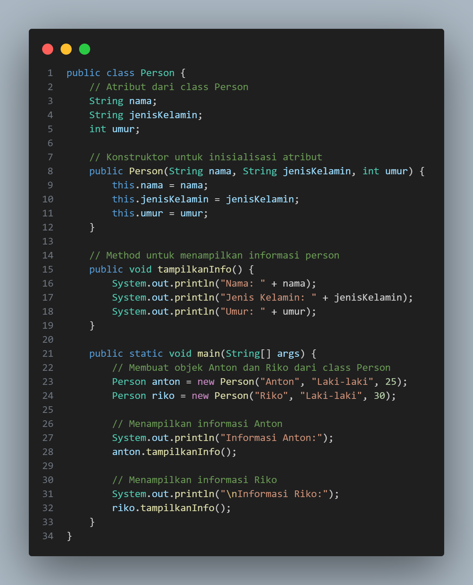
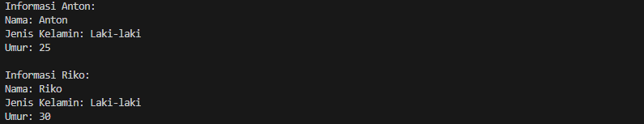

# Pemrograman Berorientasi Objek

## Latihan3

Konstruktor: Menetapkan saldo awal pada saat objek AkunBank dibuat.

SimpanUang(int jumlah): Method untuk menambahkan uang ke saldo dan menampilkan informasi simpanan.

CekSaldo(): Method untuk menampilkan saldo saat ini.

AmbilUang(int jumlah): Method untuk menarik uang dari saldo dengan pengecekan saldo yang mencukupi.

outputnya 

